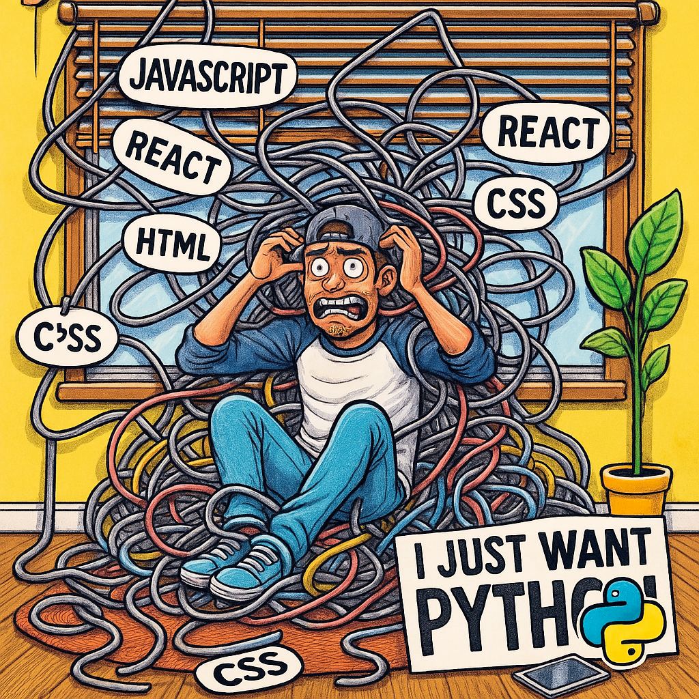

# ImGui Bundle + Pyodide: A New Frontier for Python GUI in the Browser

cf https://chatgpt.com/c/67f84fa1-03d8-8004-a70a-7d14d274933f

## 🚀 What Makes It Special

- ✅ **Immediate-mode GUI in the browser**
    - Real-time, stateful, native-feeling GUI — even inside Pyodide
    - No reactive graphs, no notebook hacks — just clean code

- ✅ **Python-first**
    - Write in Python, not JavaScript
    - Same API in Python and C++
    - Seamlessly integrates with NumPy, matplotlib, OpenCV, etc.

- ✅ **No backend required**
    - Runs fully in the browser with Pyodide
    - Perfect for demos, teaching, dashboards, or offline apps

- ✅ **Native-feeling**
    - Fast, fluid, interactive: sliders, plots, tooltips, overlays
    - Feels like a desktop app — but it’s in the browser

- ✅ **Highly customizable**
    - You have full control: render loops, input handling, docking, theming
    - Compose UIs like you would in a native engine or game dev stack

---

## 💥 Compared to Existing Tools

| Tool                       | Web? | Immediate GUI? | Python-native? | Lightweight? | Customizable? |
|----------------------------|------|----------------|----------------|--------------|----------------|
| **ImGui Bundle + Pyodide** | ✅   | ✅              | ✅              | ✅           | ✅✅✅            |
| Jupyter + ipywidgets       | ✅   | ❌              | ✅              | ❌           | ⚠️ clunky       |
| Streamlit / Dash           | ✅   | ❌              | ✅              | ⚠️           | ⚠️ limited      |
| WebAssembly UI kits (C++)  | ✅   | ✅              | ❌              | ✅           | ✅              |

> 🧠 *“The feel of a C++ desktop app, the shareability of a web page, and the accessibility of Python.”*

---

## 🌍 Ideal Use Cases

- 📈 Financial dashboards and stock visualizers
- 🧠 AI/ML demos and visualizations
- 🧪 Physics or math simulations
- 📊 Scientific dashboards with sliders, tooltips, and live plots
- 🎓 Interactive teaching tools (with zero install)
- 🔬 Offline visual data explorers for papers or labs

---

## ⚠️ Caveat: Zero Backend... Mostly

> “Zero backend (except when you have to dodge CORS dragons 🐉 — which is expected in browserland).”

When you need data from external APIs, you may still need:
- a CORS-enabled proxy
- or a small backend to protect secrets (e.g., API keys)

But otherwise, it’s fully static: just serve the HTML, JS, and `.wasm`.

---

## 🌟 Why It Matters

This stack enables something no other Python toolchain does:

> **“A real-time, zero-backend, full-Python GUI framework for the web.”**

It’s like:
- Streamlit, but faster and more interactive
- Jupyter, but cleaner and stateful
- Qt, but no install
- C++ ImGui, but in your browser, in Python

---

## 🧰 Imagine the Possibilities

- A web-based GUI playground like `imgui.bundle.org/demo`
- Embedded GUIs inside docs, blog posts, notebooks
- Standalone educational tools for students and researchers
- Fully portable GUI experiments: just share a URL

---

## 🧱 Building Blocks Already Exist

- [ImGui Bundle](https://github.com/pthom/imgui_bundle)
- [Hello ImGui](https://github.com/pthom/hello_imgui)
- [Pyodide](https://pyodide.org/)

All you need now is a little glue — and you're ready to ship something awesome.
